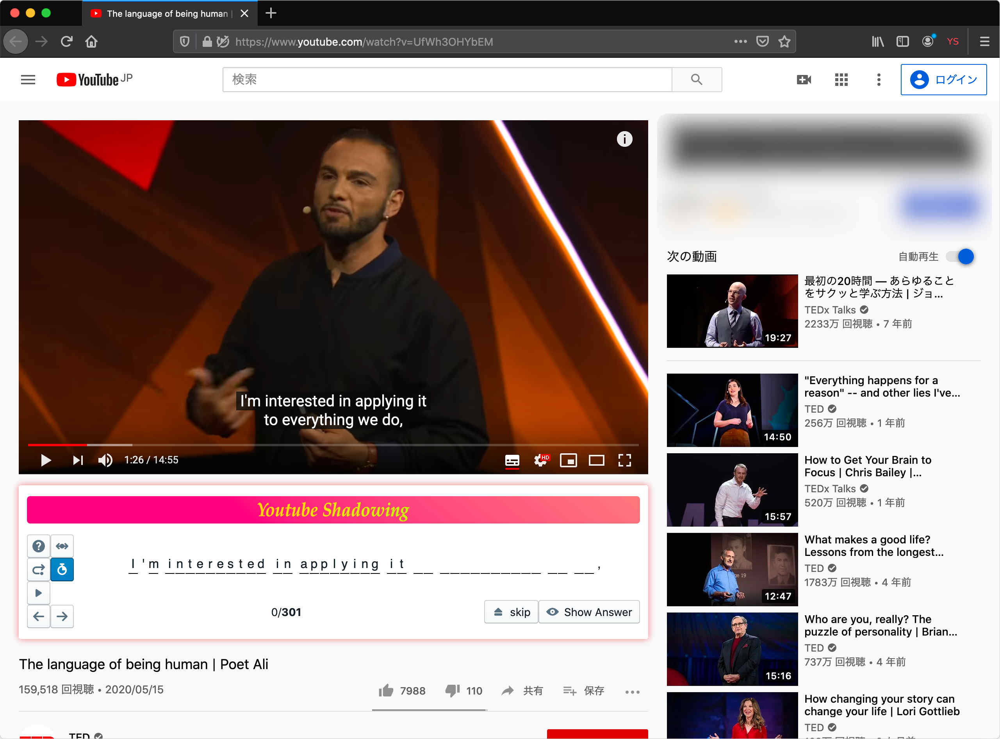
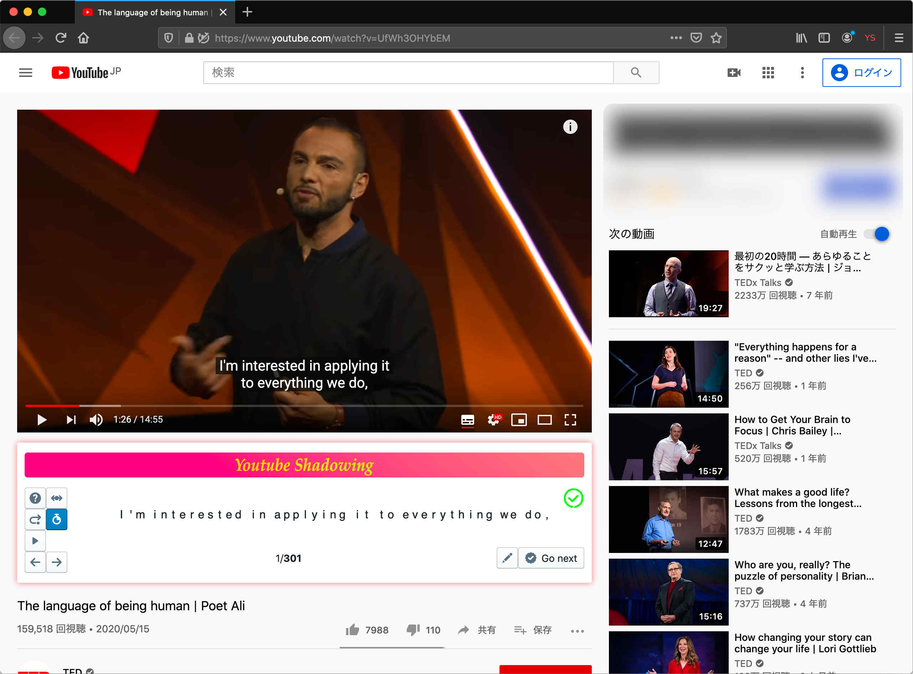
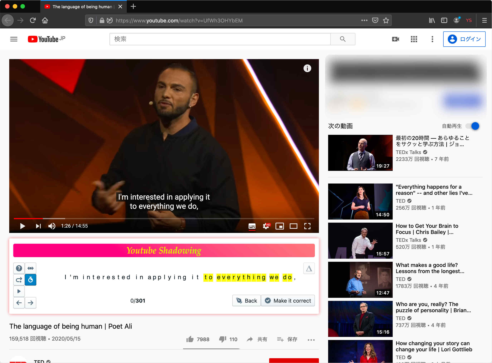
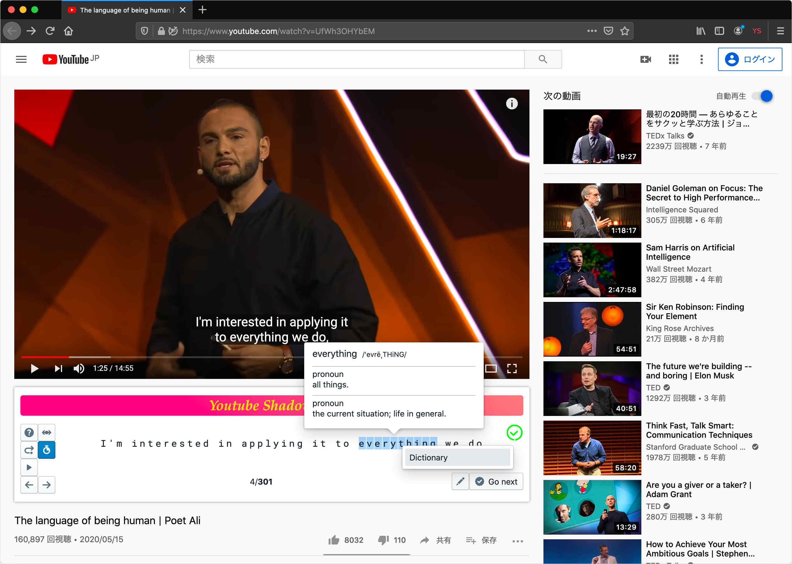

# Youtube Shadowing

## Install addon on your browser

[](https://addons.mozilla.org/en-US/firefox/addon/yt-shadow/)

## Screenshots

Initial view


Inputting



Correct



Incorrect



Dictionary



## Build Process

Run the commands below

```bash
npm i
npm run build
```

This generates `web-ext-artifacts/ytshadow-{version}.zip`

## Limitation

This addon lacks browser suppurts for belows because of dexie.js.

- Internet Explorer
- Edge(EdgeHTML)
- Safari < v10
